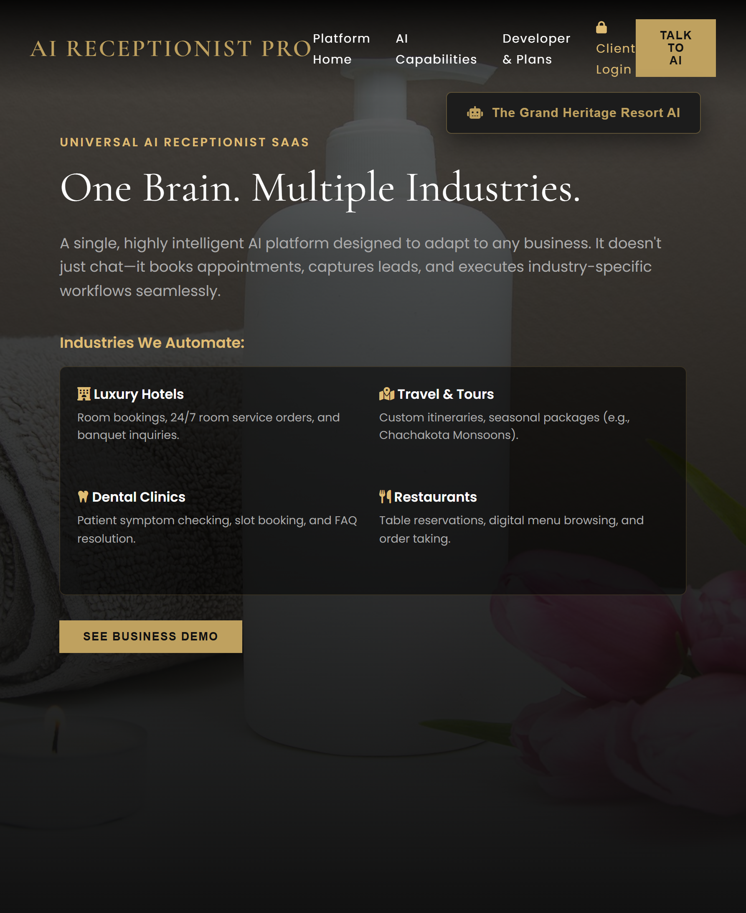
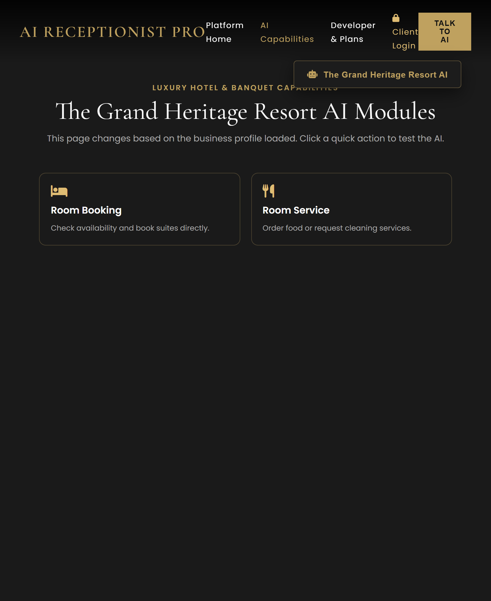
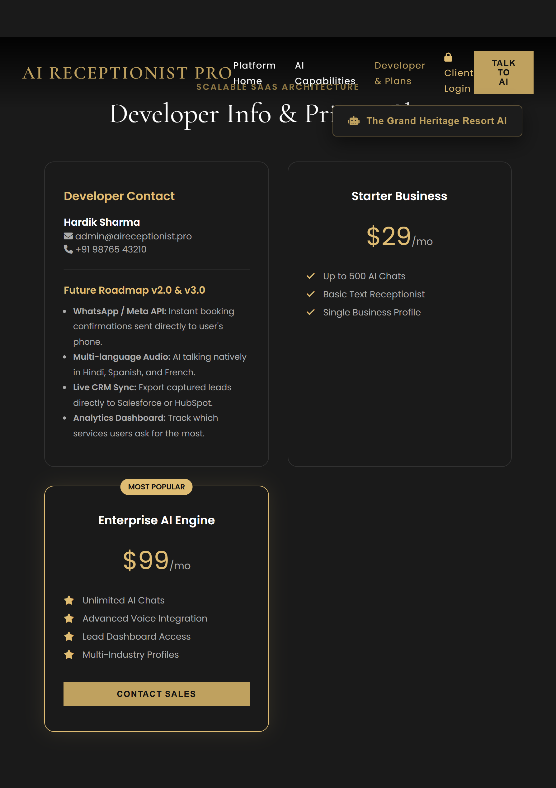
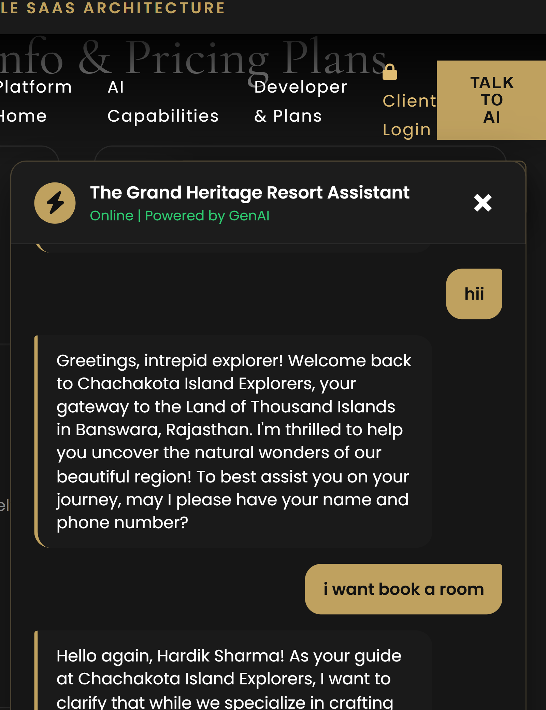

# 👑 AI Receptionist Pro | Universal SaaS Platform

AI Receptionist Pro is a highly scalable, multi-tenant SaaS platform designed to automate customer interactions across multiple industries. With a single core AI engine, the platform dynamically adapts its UI, knowledge base, and capabilities based on JSON configuration profiles.

## 📸 Platform Showcase

*(Note: Replace these placeholder paths with actual image links once uploaded to GitHub)*

*   **Platform Home (Universal Hub):** `
*   **AI Capabilities (Dynamic Quick Actions):** `
*   **Developer Info & Plans:** `
*   **Live AI Chat & Lead Engine:** `

---

## 🚀 Core Architecture & Features
*   **Universal Core Engine:** Single FastAPI backend powers multiple business profiles (Hotels, Tours, etc.) via JSON configuration.
*   **Automated Lead Capture:** AI intelligently detects names and phone numbers, saving them directly to a secure SQLite database.
*   **Secure Client Dashboard:** Password-protected admin portal for business owners to view captured leads in real-time.
*   **Voice Integration:** Native browser speech-to-text and text-to-speech capabilities for a hands-free AI experience.
*   **Single Page Application (SPA):** Seamless view switching without page reloads, preserving conversation context.

---

## 📌 Developer Memo: Future Upgrades & Roadmap

*This section serves as a tracking ledger for upcoming production updates before client handover.*

### A. Existing AI Re-Training & Refinement
1.  **The Grand Heritage Resort (Hotel AI):**
    *   *Update:* Integrate a live Room Inventory API.
    *   *Description:* Allow the AI to check real-time room availability instead of assuming static availability. Add automated POS integration for Room Service orders.
2.  **Chachakota Island Explorers (Tours AI):**
    *   *Update:* Weather API & Real-time Custom Itineraries.
    *   *Description:* Integrate a live weather API so the AI can dynamically suggest whether it's the right time to visit the "Land of Thousand Islands" or experience the rainy season greenery.

### B. New Business Modules to Add
*   **Dental/Medical Clinic:** Tasks include scheduling appointments, basic symptom checking, and answering insurance FAQs.
*   **Real Estate Agency:** Tasks include scheduling property viewings, answering questions about local amenities, and filtering properties by budget.
*   **Restaurant/Cafe:** Tasks include table reservations, digital menu browsing, and capturing dietary restrictions.

### C. 🚨 Pre-Production Checklist (Client Handoff)
Before selling this SaaS to a real client, the following critical steps must be executed:

1.  **Database Migration:** Move from SQLite to **PostgreSQL** for scalable, concurrent data handling.
2.  **WhatsApp Integration:** Integrate Twilio/Meta API inside the `save_lead_to_db` function to send instant "Booking Confirmed" messages to the user and notifications to the client.
3.  **Advanced Security:** Replace the demo `admin123` password with proper JWT authentication and hashed passwords (bcrypt).
4.  **CORS Configuration:** Restrict FastAPI CORS origins to the specific client domain instead of `["*"]`.

**Files requiring modification for Production:**
*   `backend/database.py` (Update DB URL to PostgreSQL)
*   `backend/services/ai_service.py` (Inject Twilio WhatsApp logic)
*   `backend/api/admin_routes.py` (Add JWT Dependency)
*   `backend/main.py` (Update CORS restrictions)
*   `frontend/js/core.js` (Update API endpoints to Render URL)

---
*Engineered for Scale. Built for the Future.*